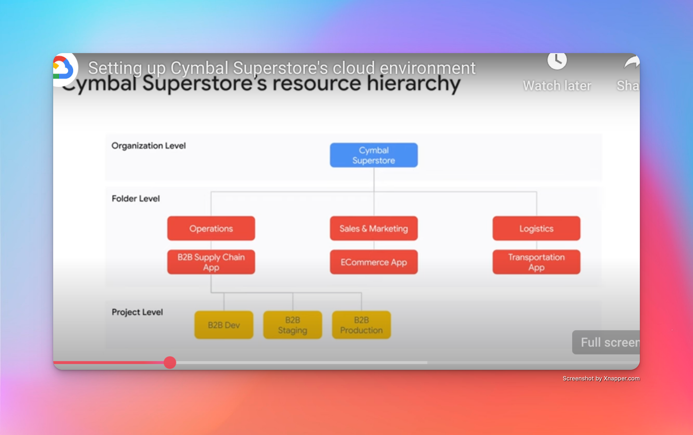

# **Associate google cloud engineer certificate study notes:**

## **role of associate cloud engineer:**

- Deploys and secures applications and infrastructure, monitors operations of multiple projects, and maintains enterprise solutions to ensure that they meet target performance metrics. 
- working with public clouds and on-premise solutions.
- able to use google cloud console and the command-line interface to perform command platform-based tasks to maintain and scale one or more deployed solutions that leverage google-managed or self-managed services on google cloud

## *COURSES**

The courses recommended for the Associate Cloud Engineer certification include:
- Google Cloud Fundamentals: Core Infrastructure, Architecting with Google Compute Engine, and Getting Started with Google Kubernetes Engine.

## *setting up cloud environment*

- establishing a resource hierarchy
    - How to set up a resource hierarchy on Google Cloud depends on the needs and structure of the organization.
    
- implementing organizational policies
- managing projects and quotas
- managing users and groups
- applying access management.
- Setting up billing and monitoring the use of your cloud resources

